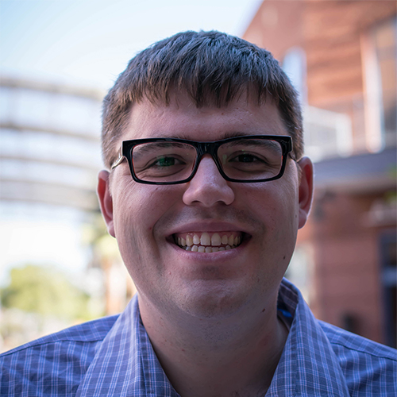

---

## Tuesday January 11 2022 at 4-6pm PST ##

| **Session I: Data Ethics and Privacy** |  <a href="https://youtu.be/xYqY4QbFQOU">**Video Recording**</a> |
| --------- | ------------------- |   
| **Overview of Privacy, Security, and Policy**   [Clifford Neuman](https://viterbi.usc.edu/directory/faculty/Neuman/B) is Associate Professor of Computer Science Practice in the Department of Computer Science at USC, and Director of the Cybersecurity Engineering Program.  He received his bachelor’s degree from the Massachusetts Institute of Technology and his MSc and PhD from the University of Washington.  He is well known for being one of the principal authors of the Kerberos authentication system. Kerberos can be used to establish an authenticated communication channel between parties, protecting the integrity of the channel, and optionally protecting the privacy of the communication.  He has been working for many years on computer security, and is currently teaching several courses at USC in this area including DSCI 523 (Computer Systems Assurance), DSCI 529 (Security and Privacy), CSCI 530 (Security Systems), and DSCI 526 (Secure Systems Administration).   <a href="Slides-Neuman.pdf">SLIDES |  |
| **Privacy Engineering: Goals and Implementation**   [Tatyana Ryutov](https://viterbi.usc.edu/directory/faculty/Ryutov/Tatyana) is a Senior Lecturer in Computer Science at USC.  She received her PhD degree from USC, and her MSc from Moscow State University.  She has taught courses on information security, computer security policy, trusted system design and development, applied cryptography, operating systems, and computer networks.  She is currently teaching DSCI 534 on Biomedical Data Privacy Issues and Solutions, a new course she developed.   <a href="Slides-Ryutov.pdf">SLIDES |  |
| **Data Privacy and Protection in the US**   [Michael Orosz](https://viterbi.usc.edu/directory/faculty/Orosz/Michael) is Research Director at the USC Information Sciences Institute, and Research Associate Professor of Civil and Environmental Engineering and Spatial Sciences.  He received his bachelor’s degree from the Colorado School of Mines, his MSc degree from the University of Colorado at Boulder, and his PhD degree from UCLA. His research interests focus on behavior-driven decision systems used in operational environments, including data security, cyber crime, homeland security, port security, and intelligent human-computer interfaces. Dr. Orosz has 28+ years experience successfully managing commercial product development and academic research projects.  He currently teaches PPDE 672 Exploration of the Intelligence Community - From Policy to Cyber Espionage in the USC Price School of Policy and Planning.   <a href="Slides-Orosz.pdf">SLIDES |  |
  

## Tuesday January 18 2022 at 12-2pm PST ##

  
| **Session II: AI Ethics and Responsibility** | <a href="https://youtu.be/kxxXNA7gaJE">**Video Recording**</a> |
| --------- | ------------------- |   
| **Ethical Considerations for AI and Machine Learning**   [Kristina Lerman](https://www.isi.edu/people/lerman/about) is a Principal Scientist at the USC Information Sciences Institute and holds a joint appointment as a Research Professor in the Computer Science Department. Trained as a physicist, she now applies network analysis and machine learning to problems in computational social science, including crowdsourcing, social network and social media analysis. Lerman has studied how biases in data (e.g., Simpson’s paradox) and networks (e.g., Friendship paradox) affect our understanding of social systems. She co-developed and co-teaches (with Fred Morstatter) a graduate-level class on “Fairness and Bias in AI”.   <a href="Slides-Lerman.pdf">SLIDES  |  |
| **Ethical Aspects for Autonomous AI Systems** [Sven Koenig](http://idm-lab.org/) s a Professor of Computer Science at USC. He is a member of the executive committee of the IEEE Global Initiative on Ethics of Autonomous and Intelligent Systems, co-founded the AAAI/ACM Conference on AI, Ethics, and Society in 2018, and co-edited a special issue of the Artificial Intelligence journal on ethics for autonomous systems.   <a href="Slides-Koenig.pdf">SLIDES |  |
| **AI Ethics and Fairness** [Fred Morstatter](https://www.isi.edu/~fredmors/) is a Research Assistant Professor of computer science at the University of Southern California and a Research Team Lead at USC’s Information Sciences Institute (ISI). His work focuses on social network analysis, misinformation detection, cultural modeling, machine learning, and fairness in AI systems. He has recently published on detecting polarization and cyberbullying in online environments. He co-developed and co-teaches (with Kristina Lerman) a graduate-level class on “Fairness and Bias in AI”.   <a href="Slides-Morstatter.pdf">SLIDES |  |
| **Ethics in Interactive AI Systems** [Keith Burghardt](https://www.isi.edu/people/keithab/about) is a Computer Scientist at the Information Sciences Institute (ISI), a unit of the University of Southern California (USC). He leads several projects covering the fields of network science, geospatial science, human biases and hate speech, and improving fairness in artificial intelligence. He is a co-organizer of the INTERSPEECH 2022 special session, “Inclusive and Fair Speech Technologies” and is PI in grants and co-author in papers on fair machine learning and impacts of biases on AI algorithms.   <a href="Slides-Burghardt.pdf">SLIDES |  |

